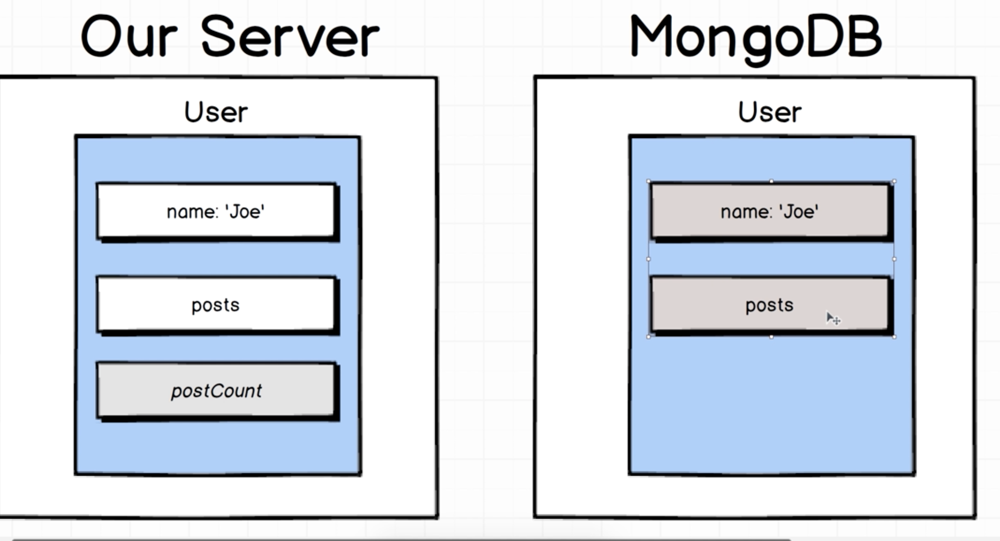
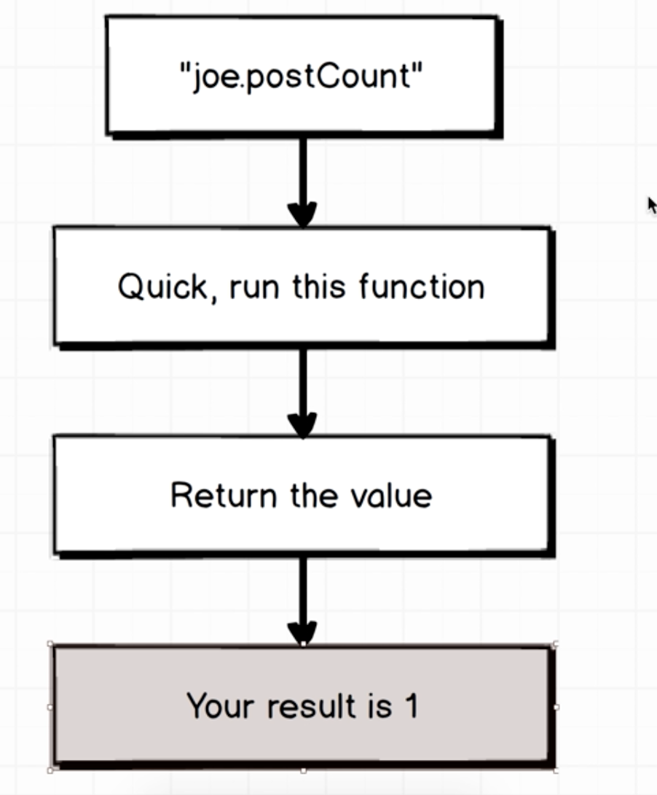

### Virtual Types

- We want to create a field that only on server not on mongodb which can be
calculated from data in mongo (like postcout comes from) length of post.


```js
const UserSchema = new Schema({
  name: {
    type: String,
    validate: {
      validator: (name) => name.length > 2,
      message: 'Name must be longer than 2 characters.'
    },
    required: [true, 'Name is required.']
  },
  posts: [PostSchema]
});
// define a virtual types
UserSchema.virtual('postCount').get(function() {
  return this.posts.length;
});
```
- We use es6 getter to help us doing this:


```js
// when calling user.postCount, it will call this get function for us.
// even though we did not use (). Note it has to be function rather than
// arrow function.
UserSchema.virtual('postCount').get(function() {
  return this.posts.length;
});
```